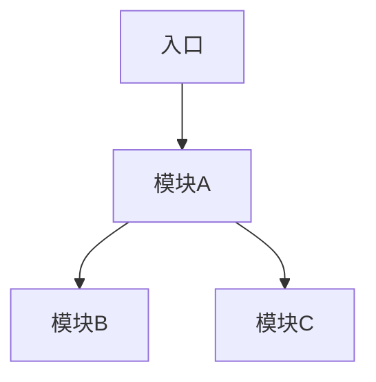
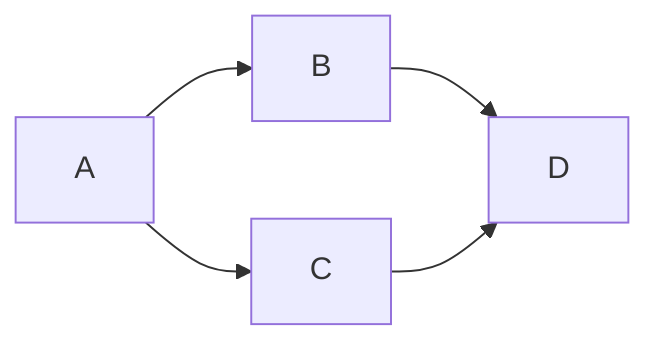

# 架构设计

> 最后更新：YYYY-MM-DD

## 整体架构

（使用 Mermaid 图描述整体架构）



## 模块划分

### 模块 A — （模块名称）

- **职责**：（描述该模块负责什么）
- **状态**：已完成 / 进行中 / 待开发 / 已废弃
- **入口**：（对外暴露的接口或入口文件）
- **依赖**：
  - 模块 B（为什么依赖）
  - 模块 C（为什么依赖）
- **被依赖**：
  - 无 / 模块 X

### 模块 B — （模块名称）

- **职责**：
- **状态**：已完成 / 进行中 / 待开发 / 已废弃
- **入口**：
- **依赖**：
- **被依赖**：

### 模块 C — （模块名称）

- **职责**：
- **状态**：已完成 / 进行中 / 待开发 / 已废弃
- **入口**：
- **依赖**：
- **被依赖**：

## 依赖关系图



（描述依赖规则，如：上层模块可以依赖下层，下层不能反向依赖上层；模块间通过接口通信等）

## 数据流

（描述核心数据如何在系统中流动）

```
用户请求 → 控制器 → 服务层 → 数据访问层 → 数据库
                ↓
             缓存层
```

## 关键接口

| 接口 | 方法 | 说明 | 所属模块 |
|------|------|------|----------|
| /api/xxx | GET | | 模块 A |
| /api/yyy | POST | | 模块 B |

## 新增功能对接规则

在向本项目添加新功能时，必须遵循以下规则：

1. **确定归属模块**：新功能属于哪个现有模块，还是需要新建模块
2. **代码位置**：
   - （描述新文件应放在哪个目录下）
3. **接口契约**：
   - （描述需要实现的接口或遵循的规范）
4. **依赖审查**：
   - 检查新功能是否引入了循环依赖
   - 检查是否重复实现了已有模块的功能
5. **避免冲突**：
   - 新增路由需要注册到（某处）
   - 新增配置项需要添加到（某文件）
   - 新增数据库表需要遵循（某命名规范）
