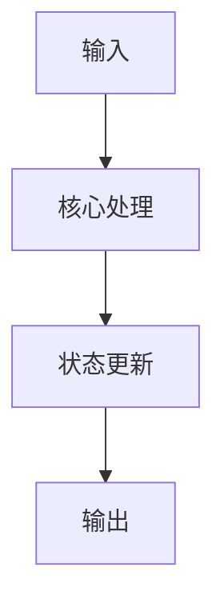

# 技术设计文档：[功能名称]

## 1. 概述

- **问题陈述**：[要解决什么技术问题]
- **当前状态**：[相关背景、现有架构、关联 PRD 或已有实现]

## 2. 技术方案

### 2.1 Why：为什么这样设计

- [说明当前方案解决了什么核心问题]
- [说明关键约束如何影响选型]

### 2.2 How：如何实现

- **架构模式**：[如 MVC、ECS、事件驱动]
- **模块划分**：[说明核心模块及职责]
- **数据流 / 控制流**：[描述输入、处理、输出路径]



### 2.3 What：落地对象

#### 组件与接口设计

```ts
interface FeatureService {
  execute(input: FeatureInput): Promise<FeatureResult>;
}
```

#### 数据模型 / API 设计

- [表结构、JSON Schema、DTO、API 端点等]

## 3. 决策记录 (Trade-offs)

| 方案 | 优点 | 缺点 | 决策 |
|------|------|------|------|
| 方案 A | [优点] | [缺点] | ✅ 采纳 |
| 方案 B | [优点] | [缺点] | ❌ 放弃，原因：[说明原因] |

## 4. 风险与待解决问题 (Open Questions)

- 风险：[描述风险]；缓解措施：[说明缓解方案]
- 待定：[描述未决问题]；需要确认方：[如 PM / 前端 / 后端]
